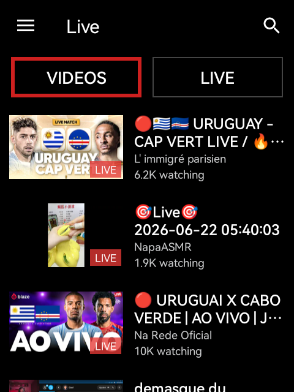
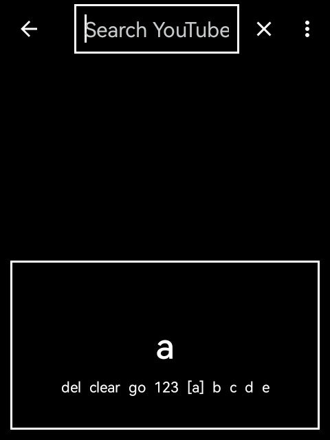
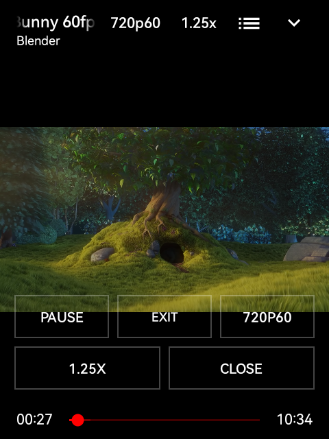

# Rokid NewPipe

NewPipe adapted for Rokid glasses.

This fork is focused on a 480 x 640, no-touch glasses workflow: swipe, tap,
back. The goal is to keep the useful parts of NewPipe while making the core
screens usable directly from the glasses, without hunting through phone-style
menus or relying on vertical gestures.

[Support Anezium on Ko-fi](https://ko-fi.com/anezium)

## Screenshots From The Glasses

These screenshots were captured from the app running on Rokid glasses.

| Home | Search keyboard |
| --- | --- |
|  |  |

| Video detail | Player actions |
| --- | --- |
|  |  |

## What Changed

- Rokid-first home screen with `Search` followed by available NewPipe kiosk categories
  kept in the top bar.
- Search opens with the Rokid-friendly on-screen keyboard.
- One-axis navigation: swipe moves focus, tap activates, back exits.
- Directional debounce prevents one physical swipe from jumping twice.
- Video detail is simplified for quick play on a small HUD.
- Player controls are reachable from a bottom action rail: play/pause, exit,
  quality, speed, subtitles, and close.
- Error states keep useful actions reachable and remove browser/phone actions
  that do not make sense on the glasses.
- UI uses black surfaces, high-contrast text, outline focus, and 480 x 640-safe
  spacing.

## Glasses Controls

- Swipe forward/back to move through focusable items.
- Tap/select to activate the focused item.
- Back closes action mode, hides the keyboard, or returns to the previous screen.
- Text entry uses the Rokid keyboard: swipe through letters/actions, tap to
  insert, and use `go` to search.

`DPAD_UP` and `DPAD_DOWN` are not required for the app UX. They are only kept as
defensive Android compatibility aliases in code, because the target glasses flow
must work with the real swipe axis plus tap/back.

## Main Screens

- **Home**: fast access to search and service kiosk categories, with
  focusable top sections and large list rows.
- **Search**: empty search opens directly into the keyboard instead of forcing a
  phone keyboard path.
- **Video detail**: compact metadata and quick play behavior for a HUD-sized
  screen.
- **Player**: tap/back friendly controls with discrete choices for quality,
  speed, subtitles, and exit.

## Build

```powershell
.\gradlew.bat :app:assembleDebug
adb -s <rokid-serial> install -r app\build\outputs\apk\debug\app-debug.apk
```

## Validation

Validated on Rokid glasses at `480x640`.

- Home top sections and list focus.
- Search keyboard display and navigation.
- Video detail launch from a YouTube URL.
- Player action rail.
- Quality, speed, subtitles, close, and exit actions.
- Swipe debounce with paired directional key events.

The latest local verification used:

```powershell
.\gradlew.bat :app:testDebugUnitTest :app:assembleDebug
```

## Notes

This is a focused glasses fork of NewPipe. It is not the upstream NewPipe
distribution, and the old phone-first README, F-Droid/store links, and upstream
usage instructions were intentionally removed because they do not describe this
Rokid build.

## License

Based on NewPipe. See [LICENSE](LICENSE).
